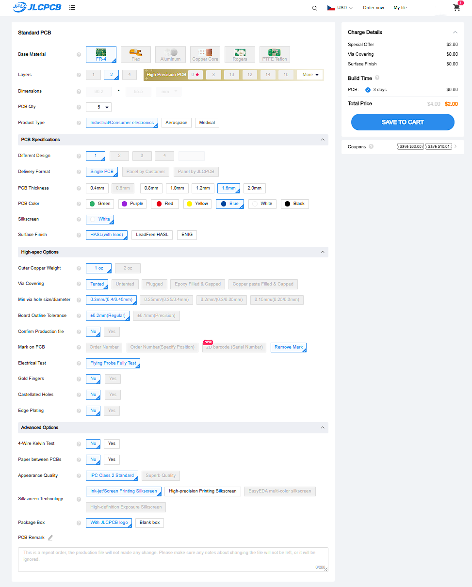
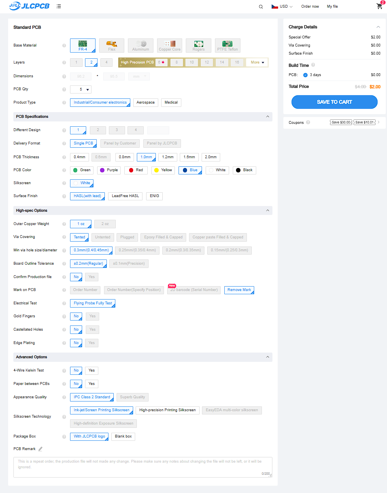
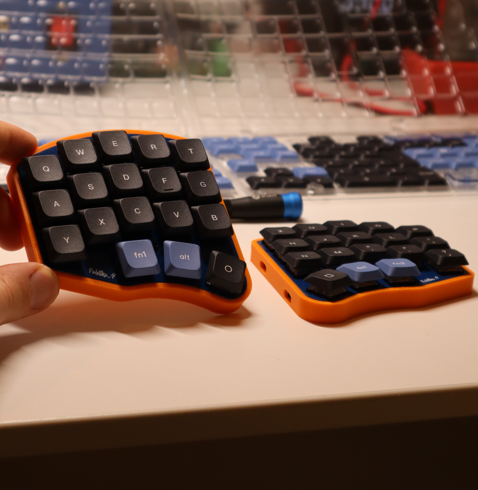

# Palettka

**Palettka is a 3x5 LP split keyboard with a 3-key thumb-cluster.**
## Keypoints:
- 💵 Very cheap build, around 50$ shipped to your door
- 🪶 Low profile and light, great for your wrists
- ⚙️ QMK firmware with VIA functionality, easy to edit keymaps
- 🌽 Key layout is very similar to Corne but with a slightly more agressive pinky stagger
- 🔌 USB C connectors only, NO more frying up your microcontrollers - YES to hot-plugging

## Bill of materials

| Item        | Quantity | Total $ | Link | Notes                                                                                               |
|-------------|----------|---------|------|-----------------------------------------------------------------------------------------------------|
| PCB         | 2pcs     | 4-10$   | [🛒 JLCPCB](https://jlcpcb.com)     | Depends on shipping and taxes but should be around 5 bucks                                          |
| Plate       | 2pcs     | 4-10$   | [🛒 JLCPCB](https://jlcpcb.com)     | Depends on shipping and taxes but should be around 5 bucks                                          |
| Switches    | 36pcs    | 6$      | [🛒 AliExpress](https://www.aliexpress.com/item/1005005818694764.html?pdp_ext_f=%7B%22sku_id%22%3A%2212000034477790069%22%7D&sourceType=1&spm=a2g0o.wish-manage-home.0.0) | 50pcs in one bag, watch out for bent pins. |
| Keycaps     | 36pcs    | 12-20$  | [🛒 AliExpress](https://www.aliexpress.com/item/1005004840360158.html?spm=a2g0o.detail.pcDetailTopMoreOtherSeller.2.74d7kV6lkV6lSk&gps-id=pcDetailTopMoreOtherSeller&scm=1007.40050.354490.0&scm_id=1007.40050.354490.0&scm-url=1007.40050.354490.0&pvid=71e81382-c4b9-4d4e-ab54-621dcc776dd2&_t=gps-id:pcDetailTopMoreOtherSeller,scm-url:1007.40050.354490.0,pvid:71e81382-c4b9-4d4e-ab54-621dcc776dd2,tpp_buckets:668%232846%238114%231999&pdp_ext_f=%7B%22order%22%3A%22751%22%2C%22eval%22%3A%221%22%2C%22sceneId%22%3A%2230050%22%7D&pdp_npi=4%40dis%21USD%2120.44%2112.88%21%21%2120.44%2112.88%21%402103864c17456962106585145ed692%2112000033198291368%21rec%21CZ%212454624435%21X&utparam-url=scene%3ApcDetailTopMoreOtherSeller%7Cquery_from%3A) | Go for low profile sets, Womier sells decent ones that I use |
| Case        | 2pcs     | 2$      | [🛒 JLC3D](https://jlc3dp.com) | Could be higher if you do not have a 3D printer, either use JLC3D or your local 3D printing service |
| USB-C cable | 2pcs     | 8$      | [🛒 AliExpress](https://www.aliexpress.com/item/1005006505041416.html?spm=a2g0o.productlist.main.41.54a2141aslgvpM&algo_pvid=c8ad3c9f-381a-47f7-a043-95d4a47360b0&algo_exp_id=c8ad3c9f-381a-47f7-a043-95d4a47360b0-20&pdp_ext_f=%7B%22order%22%3A%2217637%22%2C%22eval%22%3A%221%22%7D&pdp_npi=4%40dis%21USD%213.21%213.21%21%21%213.21%213.21%21%40211b819117456967330846554e8c11%2112000037443936904%21sea%21CZ%212454624435%21X&curPageLogUid=r0OI5MkUzM34&utparam-url=scene%3Asearch%7Cquery_from%3A) | 50 cm is ideal but 100cm is ok as-well, you will need a USB-C to USB-C and a USB-C to USB-A |
| USB-C 6pin | 2pcs     | 2$  | [🛒 AliExpress](https://www.aliexpress.com/item/1005007404407571.html?spm=a2g0o.order_list.order_list_main.28.33ef18027NBxMX)     | Go only for the 6pin ones with legs poking down                                         |
| 1N4148W         | 36pcs     | 2$   | [🛒 AliExpress](https://www.aliexpress.com/item/1005008559061422.html?spm=a2g0o.productlist.main.9.132c1a7dIALM9N&algo_pvid=785631b4-29bd-4a21-b9bd-a0dd223a2fdd&algo_exp_id=785631b4-29bd-4a21-b9bd-a0dd223a2fdd-4&pdp_ext_f=%7B%22order%22%3A%221215%22%2C%22eval%22%3A%221%22%2C%22orig_sl_item_id%22%3A%221005008559061422%22%2C%22orig_item_id%22%3A%221005005707644429%22%7D&pdp_npi=4%40dis%21USD%213.76%211.88%21%21%2127.30%2113.65%21%40211b6c1717456994876237865ec7b0%2112000045713280629%21sea%21CZ%212454624435%21X&curPageLogUid=zzvaIaRNyopf&utparam-url=scene%3Asearch%7Cquery_from%3A)     | SOD-123 package, it is a SMD package                               |
| RP2040-Zero         | 2pcs     | 5$   | [🛒 AliExpress](https://www.aliexpress.com/w/wholesale-rp2040-zero.html?spm=a2g0o.productlist.search.0)     |I usually buy from TenStarRobot shop                                          |
| M2x4        | 10pcs    | 2$      | [🛒 AliExpress](https://www.aliexpress.com/item/32810852732.html?spm=a2g0o.productlist.main.3.31c24d9586plEQ&algo_pvid=c52546e2-d48f-48a0-962e-8c84b8276c95&algo_exp_id=c52546e2-d48f-48a0-962e-8c84b8276c95-1&pdp_ext_f=%7B%22order%22%3A%2214716%22%2C%22eval%22%3A%221%22%7D&pdp_npi=4%40dis%21USD%212.57%212.57%21%21%212.57%212.57%21%40210385db17456974058006383e99e7%2112000037550700724%21sea%21CZ%212454624435%21X&curPageLogUid=PoVLulWpUauT&utparam-url=scene%3Asearch%7Cquery_from%3A) | Ideally go for black steel screws with either a torx or hex head                                    |
| M2x6        | 10pcs    | 2$      | [🛒 AliExpress](https://www.aliexpress.com/item/32810852732.html?spm=a2g0o.productlist.main.3.31c24d9586plEQ&algo_pvid=c52546e2-d48f-48a0-962e-8c84b8276c95&algo_exp_id=c52546e2-d48f-48a0-962e-8c84b8276c95-1&pdp_ext_f=%7B%22order%22%3A%2214716%22%2C%22eval%22%3A%221%22%7D&pdp_npi=4%40dis%21USD%212.57%212.57%21%21%212.57%212.57%21%40210385db17456974058006383e99e7%2112000037550700724%21sea%21CZ%212454624435%21X&curPageLogUid=PoVLulWpUauT&utparam-url=scene%3Asearch%7Cquery_from%3A) | Ideally go for black steel screws with either a torx or hex head                                    |
| Spacers     | 10pcs    | 3$      | [🛒 AliExpress](https://www.aliexpress.com/item/1005002249479644.html?spm=a2g0o.productlist.main.27.115e3ec0An3Tff&algo_pvid=cc638886-0911-42f3-aa69-42ab0464883a&algo_exp_id=cc638886-0911-42f3-aa69-42ab0464883a-13&pdp_ext_f=%7B%22order%22%3A%22393%22%2C%22eval%22%3A%221%22%7D&pdp_npi=4%40dis%21USD%212.58%212.58%21%21%212.58%212.58%21%40211b813b17456972552947163e8b2a%2112000019652348049%21sea%21CZ%212454624435%21X&curPageLogUid=BiDbiqYLDnxS&utparam-url=scene%3Asearch%7Cquery_from%3A) | Brass round spacers M2x7mm with OD 3mm |

## Ordering guide
### [JLCPCB](https://jlcpcb.com)
This is the FAB house of my choice, since the PCB is designed to fit into the special offer 10x10cm constraint by JLCPCB, it seems like a really good choice (2$ for 5pcs).
#### JLC options
- PCB quantity: 5
- Different designs: 1
- Thickness: 1.6mm
- Color: blue, or whatever you prefer
- Finish: doesnt really matter
- Mark on PCB: remove mark

**PCB**
---------------
**Choose whatever color you want BUT CHOOSE THICKNESS OF 1.6MM.**

**Plate**
---------------
**Choose whatever color you want BUT CHOOSE THICKNESS OF 1.0MM.**

## Build guide
### Soldering
You will need a soldering iron and some solder
### Case assembly
### Firmware flashing
### Customization
## Images
*Palettka in an orange case🧡*

*Thin and light-weight*

*Only USB-C connectors no more 🔥💀 microcontrollers*

*Fancy blue PCB and clicky switches*
