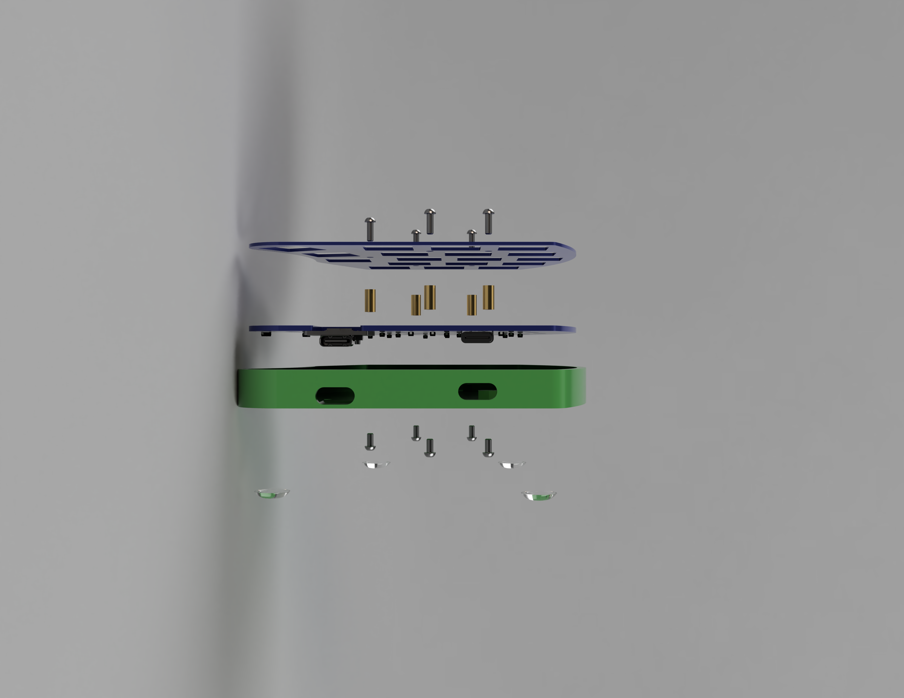

# Palettka

**
Palettka is a 3x5 LP split keyboard with a 3-key thumb-cluster.
**
## Keypoints:
- 💵 Very cheap build, around 50$ shipped to your door
- 🪶 Low profile and light, great for your wrists
- ⚙️ QMK firmware with VIA functionality, easy to edit keymaps
- 🌽 Key layout is very similar to Corne but with a slightly more agressive pinky stagger
- 🔌 USB C connectors only, NO more frying up your microcontrollers - YES to hot-plugging

*Side note:* The PCB is reversible and was designed to fit into JLCPCB special offer, where if you make your PCB smaller then 10x10cm you get 5 pieces for just 2 dollars. Same offer is used for the plate, but you can 3D print it yourself if you want. The Redragon low-profile switches are used in this build. They are extremely cheap for low-profile switches and feel okay, but don't expect anything special. In my opinion the red and black ones feel the best. Blue ones are little bit mushy but they do go *click-click* if thats what you are looking for.
## Bill of materials

| Item        | Quantity | Total $ | Link | Notes                                                                                               |
|-------------|----------|---------|------|-----------------------------------------------------------------------------------------------------|
| PCB         | 2pcs     | 4-10$   | [🛒 JLCPCB](https://jlcpcb.com)     | Depends on shipping and taxes but should be around 5 bucks                                          |
| Plate       | 2pcs     | 4-10$   | [🛒 JLCPCB](https://jlcpcb.com)     | Depends on shipping and taxes but should be around 5 bucks                                          |
| Switches    | 36pcs    | 6$      | [🛒 AliExpress](https://www.aliexpress.com/item/1005005818694764.html?pdp_ext_f=%7B%22sku_id%22%3A%2212000034477790069%22%7D&sourceType=1&spm=a2g0o.wish-manage-home.0.0) | 50pcs in one bag, watch out for bent pins. |
| Keycaps     | 36pcs    | 12-20$  | [🛒 AliExpress](https://www.aliexpress.com/item/1005004840360158.html?spm=a2g0o.detail.pcDetailTopMoreOtherSeller.2.74d7kV6lkV6lSk&gps-id=pcDetailTopMoreOtherSeller&scm=1007.40050.354490.0&scm_id=1007.40050.354490.0&scm-url=1007.40050.354490.0&pvid=71e81382-c4b9-4d4e-ab54-621dcc776dd2&_t=gps-id:pcDetailTopMoreOtherSeller,scm-url:1007.40050.354490.0,pvid:71e81382-c4b9-4d4e-ab54-621dcc776dd2,tpp_buckets:668%232846%238114%231999&pdp_ext_f=%7B%22order%22%3A%22751%22%2C%22eval%22%3A%221%22%2C%22sceneId%22%3A%2230050%22%7D&pdp_npi=4%40dis%21USD%2120.44%2112.88%21%21%2120.44%2112.88%21%402103864c17456962106585145ed692%2112000033198291368%21rec%21CZ%212454624435%21X&utparam-url=scene%3ApcDetailTopMoreOtherSeller%7Cquery_from%3A) | Go for low profile sets, Womier sells decent ones that I use |
| Case        | 2pcs     | 2$      | [🛒 JLC3D](https://jlc3dp.com) | Could be higher if you do not have a 3D printer, either use JLC3D or your local 3D printing service |
| USB-C cable | 2pcs     | 8$      | [🛒 AliExpress](https://www.aliexpress.com/item/1005006505041416.html?spm=a2g0o.productlist.main.41.54a2141aslgvpM&algo_pvid=c8ad3c9f-381a-47f7-a043-95d4a47360b0&algo_exp_id=c8ad3c9f-381a-47f7-a043-95d4a47360b0-20&pdp_ext_f=%7B%22order%22%3A%2217637%22%2C%22eval%22%3A%221%22%7D&pdp_npi=4%40dis%21USD%213.21%213.21%21%21%213.21%213.21%21%40211b819117456967330846554e8c11%2112000037443936904%21sea%21CZ%212454624435%21X&curPageLogUid=r0OI5MkUzM34&utparam-url=scene%3Asearch%7Cquery_from%3A) | 50 cm is ideal but 100cm is ok as-well, you will need a USB-C to USB-C and a USB-C to USB-A |
| USB-C 6pin | 2pcs     | 2$  | [🛒 AliExpress](https://www.aliexpress.com/item/1005007404407571.html?spm=a2g0o.order_list.order_list_main.28.33ef18027NBxMX)     | Go only for the 6pin ones with legs poking down                                         |
| 1N4148W         | 36pcs     | 2$   | [🛒 AliExpress](https://www.aliexpress.com/item/1005008559061422.html?spm=a2g0o.productlist.main.9.132c1a7dIALM9N&algo_pvid=785631b4-29bd-4a21-b9bd-a0dd223a2fdd&algo_exp_id=785631b4-29bd-4a21-b9bd-a0dd223a2fdd-4&pdp_ext_f=%7B%22order%22%3A%221215%22%2C%22eval%22%3A%221%22%2C%22orig_sl_item_id%22%3A%221005008559061422%22%2C%22orig_item_id%22%3A%221005005707644429%22%7D&pdp_npi=4%40dis%21USD%213.76%211.88%21%21%2127.30%2113.65%21%40211b6c1717456994876237865ec7b0%2112000045713280629%21sea%21CZ%212454624435%21X&curPageLogUid=zzvaIaRNyopf&utparam-url=scene%3Asearch%7Cquery_from%3A)     | SOD-123 package, it is a SMD package                               |
| RP2040-Zero         | 2pcs     | 5$   | [🛒 AliExpress](https://www.aliexpress.com/w/wholesale-rp2040-zero.html?spm=a2g0o.productlist.search.0)     |I usually buy from TenStarRobot shop                                          |
| M2x4        | 10pcs    | 2$      | [🛒 AliExpress](https://www.aliexpress.com/item/32810852732.html?spm=a2g0o.productlist.main.3.31c24d9586plEQ&algo_pvid=c52546e2-d48f-48a0-962e-8c84b8276c95&algo_exp_id=c52546e2-d48f-48a0-962e-8c84b8276c95-1&pdp_ext_f=%7B%22order%22%3A%2214716%22%2C%22eval%22%3A%221%22%7D&pdp_npi=4%40dis%21USD%212.57%212.57%21%21%212.57%212.57%21%40210385db17456974058006383e99e7%2112000037550700724%21sea%21CZ%212454624435%21X&curPageLogUid=PoVLulWpUauT&utparam-url=scene%3Asearch%7Cquery_from%3A) | Ideally go for black steel screws with either a torx or hex head                                    |
| M2x6        | 10pcs    | 2$      | [🛒 AliExpress](https://www.aliexpress.com/item/32810852732.html?spm=a2g0o.productlist.main.3.31c24d9586plEQ&algo_pvid=c52546e2-d48f-48a0-962e-8c84b8276c95&algo_exp_id=c52546e2-d48f-48a0-962e-8c84b8276c95-1&pdp_ext_f=%7B%22order%22%3A%2214716%22%2C%22eval%22%3A%221%22%7D&pdp_npi=4%40dis%21USD%212.57%212.57%21%21%212.57%212.57%21%40210385db17456974058006383e99e7%2112000037550700724%21sea%21CZ%212454624435%21X&curPageLogUid=PoVLulWpUauT&utparam-url=scene%3Asearch%7Cquery_from%3A) | Ideally go for black steel screws with either a torx or hex head                                    |
| Spacers     | 10pcs    | 3$      | [🛒 AliExpress](https://www.aliexpress.com/item/1005002249479644.html?spm=a2g0o.productlist.main.27.115e3ec0An3Tff&algo_pvid=cc638886-0911-42f3-aa69-42ab0464883a&algo_exp_id=cc638886-0911-42f3-aa69-42ab0464883a-13&pdp_ext_f=%7B%22order%22%3A%22393%22%2C%22eval%22%3A%221%22%7D&pdp_npi=4%40dis%21USD%212.58%212.58%21%21%212.58%212.58%21%40211b813b17456972552947163e8b2a%2112000019652348049%21sea%21CZ%212454624435%21X&curPageLogUid=BiDbiqYLDnxS&utparam-url=scene%3Asearch%7Cquery_from%3A) | Brass round spacers M2x7mm with OD 3mm |

## Ordering guide
### [JLCPCB](https://jlcpcb.com)
This is the FAB house of my choice, since the PCB is designed to fit into the special offer 10x10cm constraint by JLCPCB, it seems like a really good choice (2$ for 5pcs).

### PCB

#### PCB OPTIONS
- PCB quantity: 5
- Different designs: 1
- Thickness: 1.6mm
- Color: blue, or whatever you prefer
- Finish: doesnt really matter
- Mark on PCB: remove mark
*PCB is reversible so you only need to order it once*

**Choose whatever color you want BUT CHOOSE THICKNESS OF 1.6MM.**

### PLATE

#### PLATE OPTIONS
- PCB quantity: 5
- Different designs: 1
- Thickness: 1mm
- Color: blue, or whatever you prefer
- Finish: doesnt really matter
- Mark on PCB: remove mark

*Plate is reversible as well but order it in 1mm thickness*

**Choose whatever color you want BUT CHOOSE THICKNESS OF 1.0MM.**

## Build guide🛠️

### Soldering
If you want to solder the board yourself instead of ordering already preassembled one you will need a few items.
- Soldering iron
- Solder 0.7mm or smaller
- Tweezers
- Flux
- Solder sucker (optional for reworking)

**
Lets get started!
**
#### Step 1 - Layout the PCBs
Place two PCBs on your table so that the cutouts are facing each other, they shoud be facing each other and be on the bottom of the board.

#### Step 2 - SMD Components
Carefully open up your tape of diodes, but uncover about 10 of them max, otherwise you might bump into them and lose them. Prepare the two microcontrollers (RP-2040 Zero) and two USB-C connectors. Arrange your PCBs near the edge of your table and put all of the SMD components farther away from you.

#### Step 3 - Soldering diodes
Locate all the pads for diodes, they should be marked with |<- symbol. Each diode has two pads that you will need to solder it to. To make it easier we will pre-tin one of the pads for each diode. Heat up your soldering iron to 335&deg;C and put some solder on the tip of your iron to deoxidize it and then wipe it off. Once you are ready press the tip of the iron to the pad and add some solder. You should feed the solder into both, the tip of the iron and the pad at the same time. Try to do it under 5 seconds so that you dont heat up the pad too much but dont be too scared if you need more time. Now do it 35 more times 🤖.

 After you are done tinning the pads grab your tweezers and one diode. You will see a small line on one end of the diode, you should match that line with the line on the PCB. Place the diode so that both leads are on the pads, reheat the solder we added before and and hold it there for atleast 2 seconds. Properly heating the diode's leads ensures the solder bonds effectively with both the lead and the pad, forming a solid electrical and mechanical connection. Move on to the second lead and again heat up the lead, then add a small amount of solder and let it cool down.

#### Step 4 - Soldering USB-C
I wish i had some tips but this part can be pretty tricky, especially the ground leads of the connector. For the pads i add little bit of flux, put solder on my iron tip and then slowly move it across all the pins of the connectors. If you do it correctly there should be no short between them. Iam adding a youtube video for this part.
[Visual guide how to solder a USB-C connector](https://www.youtube.com/watch?v=e6TMxctCcxU)
#### Step 5 - Soldering microcontroller
Place the microcontroller so that the two buttons for reset and boot are facing up and the RP2040 chip is facing down. Thats how it will be soldered onto the PC board. Before you place it there though, you should pre-tin two pads in oposite corners. Doesnt really matter which ones but you can follow along with the pictures i provide. Place the controller buttons up and then align it so that both edges of FR-4 are aligned - in other words the USB-C connector needs to be sticking out outside. The pads should be aligned with the microcontroller casstelated holes but dont be afraid to move it little, the most imporant part here is that USB-C is sticking out and its somewhat centered so that the buttons can be accssed through the holes in the case. After you solder two opposite pads, you can move on soldering the rest.

*💡Small tip is to use a conical tip, sometimes called B or B-series, and press it into the castellated hole then feed the solder into both the tip and pad. This will ensure proper connection.*
#### Step 6 - Soldering switches
Insert all of the Redragon low-profile switches into the plate with the logo facing down, only expection is letter B and N (assuming qwerty layout), switches at these two positions are flipped by 180&deg; (upside down). This modification is done so that the mictrocontroller can fit in between this switch and the bottom thumb key switch. It doesnt affect the typing experience. After you are done pressing in all the switches, **check that there are no bent pins and double check that they are straight** otherwise you might run into issues in next step. Align the plate with the PCB and slowly start pressing the two boards together. Watch how the pins slide into the PCB and look for potentionally stucked ones. It should go very smoothly without any significant resistance, if you cant press them together, slowy separate the two boards and check the pins again and try to straighten them with pliers if they are even slighty missaligned. Once the boards are together you can apply little bit more pressure and then solder all the 72 pins of the switches (both boards).

#### Step ?? - Create a YouTube video

### Case assembly
#### Step 1 - Prepare needed material
#### Step 2 - Attach spacers
#### Step 3 - Screw in the boards
#### Step 4 - Keycaps
### Firmware flashing
### Customization
## Images
*Palettka in an orange case🧡*

*Thin and light-weight*

*Only USB-C connectors no more 🔥💀 microcontrollers*

*Fancy blue PCB and clicky switches*

*Bottom of the keyboard in a exploded view, rendered*

*Side exploded view, rendered*
